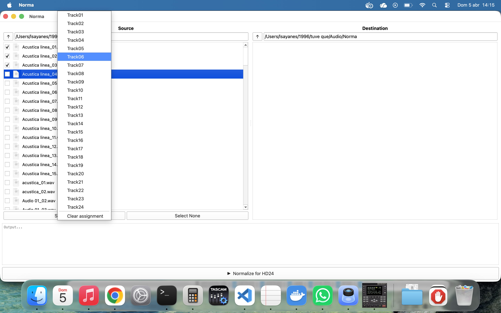
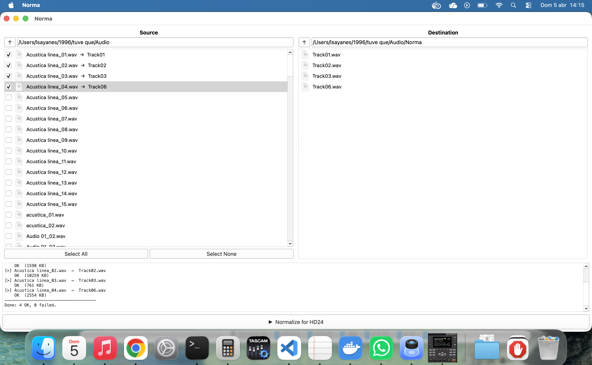

# Norma

**Norma** is a desktop utility for music producers who use **Cubase Elements** together with an **Alesis HD24** hard disk recorder.

## The problem

Recent versions of Cubase Elements add a `JUNK` chunk to every exported WAV file. According to Steinberg support this is not a bug — it is intentional behaviour defined in the **EBU TECH 3306 / RF64** specification, where the chunk acts as a reserved placeholder to allow files to grow beyond 4 GB.

The Alesis HD24 does not recognise this chunk and **rejects the files**, breaking the workflow. Removing the `JUNK` chunk manually for every export is impractical, and Cubase Elements has no option to disable it (that option, *"Do not use .64-compliant file format"*, exists only in Cubase Pro).

## The solution

Norma reads each WAV file, strips the `JUNK` chunk, and writes a clean copy to a destination folder — ready to transfer to the HD24.

## Features

- **Dual-panel file browser** (Norton Commander style)
  - Left panel — source: navigate directories, shows only `.wav` files
  - Right panel — destination: choose the output folder
- **Track name assignment** — right-click any source file to assign it a target name (`Track01` … `Track24`), matching the HD24 naming convention
- **Select All / Select None** buttons for batch processing
- **Output log** — real-time console showing progress, file sizes, and errors for every processed file
- **JUNK chunk removal** — preserves all other WAV chunks intact; handles odd-sized chunks with correct 2-byte alignment
- Cross-platform: **Linux** and **macOS** (Windows support planned)

## Requirements

| Dependency | Version |
|---|---|
| Qt | 5 or 6 (auto-detected) |
| CMake | 3.16+ |
| C++ | 17 |

## Build

### macOS (Homebrew Qt)

```bash
./build.sh
```

### Linux

```bash
./build.sh
```

> The script auto-detects Qt6/Qt5 via Homebrew or system paths.  
> Use `QT_MAJOR=5 ./build.sh` to force Qt5.

### Manual

```bash
mkdir build && cd build
cmake .. -DCMAKE_BUILD_TYPE=Release
make -j$(nproc)
```

## Usage

1. Launch `Norma`
2. In the **Source** panel, navigate to the folder containing your Cubase-exported WAV files
3. Right-click a file and assign a track name (`Track01` … `Track24`)
4. In the **Destination** panel, navigate to the target folder (e.g. the HD24 drive)
5. Click **▶ Normalize for HD24**
6. The output log shows each file processed and the final summary





## Project structure

```
Norma/
├── main.cpp          # Entry point, QApplication setup
├── Norma.h / .cpp    # Main window, deleteJunk(), output log
├── FilePanel.h / .cpp# Dual-panel file browser widget
├── resources/
│   └── Norma.png     # Application icon
└── CMakeLists.txt
```

## Background

The `JUNK` chunk removal is implemented by parsing the WAV RIFF structure at the binary level: the 12-byte RIFF/WAVE header is copied verbatim, then each subsequent chunk is read and forwarded to the output file — except any chunk with the four-character code `JUNK`, which is silently skipped. Odd-sized chunks are padded to 2-byte boundaries as required by the RIFF specification.
